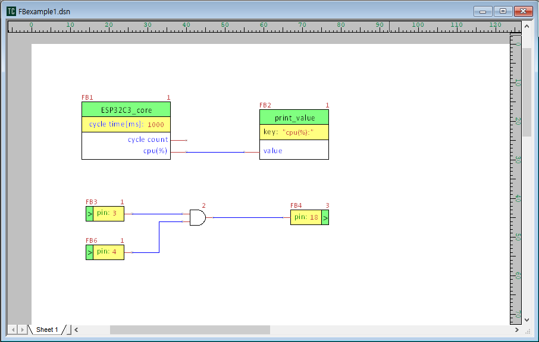

# TinyCAD-OnBlock for Windows

TinyCAD-OnBlock is schematic capture for the purpose of using TinyCAD as a Function Block Editor.  
TinyCAD-OnBlock = TinyCAD 3.00.04 + KiCad Netlist + Arduino(C++) Code Composer + FB Library  

## License
This program keeps on GNU LGPL.  

## Modifications
Some TinyCAD sources are modified and 2 files(OnBlock.h, OnBlock.cpp) are added to source by countrymaker.
The modified lines of src files are marked with " // cmaker"  

## Examples

---

___

# TinyCAD for Windows

TinyCAD is an open source circuit capture program.  The offical web-site is [www.tinycad.net](https://www.tinycad.net)

## Binaries

If you want to install TinyCAD then go to the [Downloads](https://www.tinycad.net/Home/Download) page.

## Building from source

Help on building TinyCAD from source is available in the [Wiki](https://github.com/matt123p/TinyCAD/wiki/How-to-build-TinyCAD)
